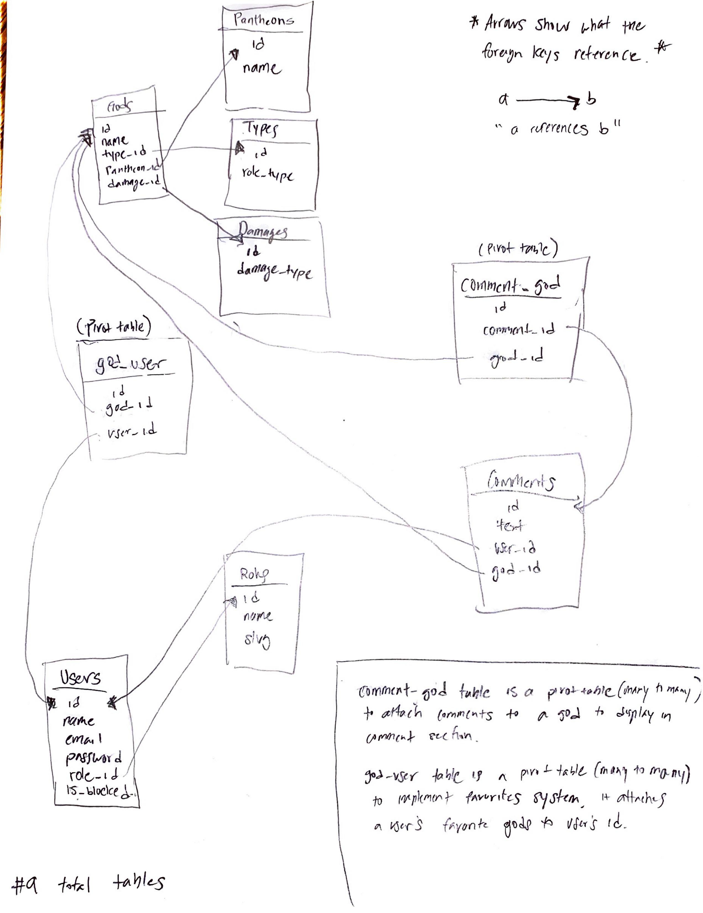

 # ITP405_Final_Project - Angel Flores

[Final Project Link](https://angelflo-finalproject.herokuapp.com/)

### Database Schema  

### What is the goal of your application?

`The Goal of my application is to Randomize the characters of a game called Smite.  
`

### Who is the primary audience?

`
The primary audience for my app are people who play the game Smite such as myself and my friends, and people world-wide.  
This game can easily be made to randomize other characters of other games as well.  
`

### What will the CRUD (Create, Read, Update, Delete) operations be?

`
Create: People will be able to add any god to their favorites list and also create new comments for any god.  
Read: There will be a set database with information of Gods (their category) which will be displayed with images  
Update: Admin can block and unblock users
Delete: PLayers can delete their comments or remove gods from their favorites.  
`

### What additional feature would you like to build?

`
I want to have players make accounts where they can choose favorite gods. This will provide quick access to builds within two-clicks.
I will also build a comment system to build sense of community.  
`